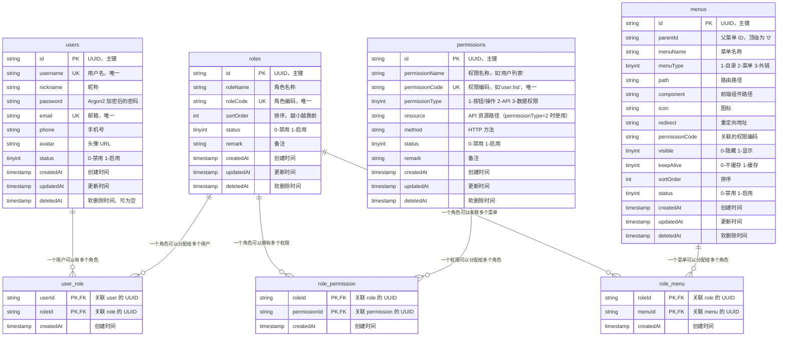

# hono-rbac-starter

中文 | [English](../README.md)

一个基于 **Hono + TypeScript** 的后端快速启动模板，集成了：

- [Hono](https://hono.dev/) - 极简、类型友好的 Web 框架
- [Drizzle ORM](https://orm.drizzle.team/) + MySQL - TypeScript-first 的 ORM
- [Zod](https://zod.dev/) - Schema 校验 + 类型推导
- [Hono JWT](https://hono.dev/docs/helpers/jwt) - JWT 签发与校验
- [Argon2](https://github.com/ranisalt/node-argon2) - 现代密码哈希算法
- [Winston](https://github.com/winstonjs/winston) + [winston-daily-rotate-file](https://github.com/winstonjs/winston-daily-rotate-file) - 结构化日志、按日期切分、自动 gzip 压缩
- [ioredis](https://github.com/redis/ioredis) - Redis 客户端，用于角色权限缓存
- 分层架构：`controller / server / dto / vo / db / middleware`
- 统一异常处理 + 统一响应格式 + 请求级 `requestId` 链路追踪
- 完整 RBAC 表结构：用户 / 角色 / 权限 / 菜单四实体 + 三张关联表

> 想看完整的实现思路与每个模块的讲解？请阅读 [`TUTORIAL.md`](../TUTORIAL.md)。

---

## 目录结构

```
hono-test/
├── drizzle/                 drizzle-kit 生成的迁移 SQL
├── logs/                    运行时日志（gitignore，按日期切分 + gzip 压缩）
|── scripts/
|   ├── seed.ts          初始化数据脚本
├── src/
│   ├── index.ts             应用入口（路由挂载、全局异常、请求日志）
│   ├── redis.ts             Redis 连接实例（ioredis）
│   ├── controller/           接口层
│   ├── service/             业务层
│   │   ├── user.ts           用户业务
│   │   └── permissions.ts    权限/角色查询服务（供 roleAuth 使用）
│   ├── db/                  drizzle 实例 + schema
│   │   ├── index.ts         drizzle 连接实例
│   │   ├── schema/          表结构定义（每个实体或关系一张文件）
│   │   │   ├── common.ts      所有表的公共字段（id / createdAt / updatedAt / deletedAt）
│   │   │   ├── users.ts       用户表
│   │   │   ├── roles.ts       角色表
│   │   │   ├── permissions.ts  权限表（按钮/API）
│   │   │   ├── menus.ts       菜单表（从权限表分离）
│   │   │   ├── user_role.ts    用户-角色 关联表
│   │   │   ├── role_permission.ts  角色-权限 关联表
│   │   │   └── role_menu.ts    角色-菜单 关联表
│   │   └── relations.ts      所有表之间的关系定义
│   ├── dto/                 入参 + zod schema
│   ├── vo/                  出参视图对象
│   ├── middleware/          jwtAuth / roleAuth / redis.middleware / zValidator / requestLogger
│   ├── exceptions/          自定义异常
│   ├── types/               Hono Variables 等共享类型
│   ├── utils/               常量、统一响应、logger
│   └── env.d.ts             process.env 类型
├── drizzle.config.ts
├── tsconfig.json
└── package.json
```

---

## 数据库设计（RBAC）

本项目实现了完整的 **RBAC（基于角色的访问控制）** 表结构，包含 7 张表：



**设计要点**：

- 所有主键均使用 **UUID v4**（`char(36)`），跨环境迁移不易冲突
- 所有表均包含 `createdAt / updatedAt / deletedAt`（软删除），通过 `commonSchema` 统一定义
- **菜单从权限表分离**：菜单（menus）专注于前端路由与组件，权限（permissions）专注于按钮操作与 API 鉴权，解除耦合
- 三张关联表（user_role / role_permission / role_menu）均无 id 主键，使用联合主键（roleId + XxxId）

---

## 快速开始

### 1. 环境要求

- Node.js >= 20
- MySQL >= 8.0
- Redis >= 6.0
- 推荐使用 [pnpm](https://pnpm.io/)

### 2. 安装依赖

```bash
pnpm install
```

### 3. 配置环境变量

在项目根目录创建 `.env` 文件：

```dotenv
# MySQL 连接串
DATABASE_URL=mysql://用户名:密码@localhost:3306/hono_test

# JWT 密钥与过期时间
JWT_SECRET=请改成你自己的随机长字符串
JWT_EXPIRES_IN=24h

# Redis
REDIS_HOST=127.0.0.1
REDIS_PORT=6379
REDIS_PASSWORD=
REDIS_DB=0

# 可选：日志相关
# NODE_ENV=production      # 生产环境会让控制台输出也走 JSON 格式
# LOG_LEVEL=info           # error / warn / info / http / debug / silly
# LOG_DIR=/var/log/hono    # 自定义日志目录，默认 <cwd>/logs
```

### 4. 创建数据库并执行迁移

```bash
# 提前在 MySQL 里建库
mysql -uroot -p -e "CREATE DATABASE hono_test DEFAULT CHARSET utf8mb4;"

# 根据 src/db/schema/ 生成迁移 SQL
pnpm db:g

# 把迁移应用到数据库
pnpm db:m

# 初始化种子数据（角色/权限/菜单/超级管理员账号）
pnpm db:seed
```

### 5. 启动开发服务

```bash
pnpm dev
```

服务默认运行在 <http://localhost:3000>。

---

## NPM 脚本

| 命令           | 说明                                                         |
| -------------- | ------------------------------------------------------------ |
| `pnpm dev`     | `tsx watch src/index.ts`，开发模式 + 热更新                  |
| `pnpm build`   | `tsc`，编译 TypeScript 到 `dist/`                            |
| `pnpm start`   | `node dist/index.js`，运行编译后的产物                       |
| `pnpm db:g`    | `drizzle-kit generate`，根据 schema 生成迁移                 |
| `pnpm db:m`    | `drizzle-kit migrate`，把迁移应用到 MySQL                    |
| `pnpm db:seed` | `tsx scripts/seed.ts`，初始化种子数据（角色/权限/菜单/用户） |

---

## 初始账号

执行 `pnpm db:seed` 后会自动插入以下账号：

| 角色       | 用户名  | 密码          | 说明                    |
| ---------- | ------- | ------------- | ----------------------- |
| 超级管理员 | `admin` | `admin123456` | 拥有全部权限和菜单      |
| 普通用户   | `user`  | `user123456`  | 仅可访问 Dashboard 页面 |

---

## API 一览

| Method | Path          | 鉴权 | 入参                                             | 说明                    |
| ------ | ------------- | ---- | ------------------------------------------------ | ----------------------- |
| POST   | `/user/login` | -    | `{ email, password }` (json)                     | 登录，返回 user + token |
| POST   | `/user`       | JWT  | `{ username, nickname, email, password }` (json) | 创建用户                |
| GET    | `/user`       | JWT  | `?page&pageSize&keyword` (query)                 | 分页 + 关键字搜索       |
| GET    | `/user/:id`   | JWT  | `id` (param，UUID 格式)                          | 查询单个用户            |

> 所有接口的响应都遵循统一格式：
>
> ```jsonc
> // 成功
> { "success": true,  "data": { ... }, "errorCode": 0,   "message": "ok" }
>
> // 失败
> { "success": false, "data": null,    "errorCode": 401, "message": "token 已过期" }
> ```

---

## 联调示例

```bash
# 1. 登录
curl -X POST http://localhost:3000/user/login \
  -H 'Content-Type: application/json' \
  -d '{"email":"admin@example.com","password":"admin123456"}'

# 2. 带 token 访问受保护接口
curl http://localhost:3000/user \
  -H 'Authorization: Bearer <第一步拿到的 token>'

# 3. 查询单个用户（id 为 UUID）
curl http://localhost:3000/user/<uuid> \
  -H 'Authorization: Bearer <token>'
```

---

## 中间件

项目通过 Hono 中间件实现鉴权、缓存与请求追踪等横切关注点，均位于 `src/middleware/`：

| 中间件             | 说明                                                                                                       |
| ------------------ | ---------------------------------------------------------------------------------------------------------- |
| `jwtAuth`          | JWT 解析与校验，校验通过后把 `payload` 写入 `c.var.jwtPayload`                                             |
| `roleAuth`         | 角色 / 权限鉴权，基于 `c.var.jwtPayload` 调用 `permissions` 服务校验当前用户是否具备指定角色编码或权限编码 |
| `redis.middleware` | 角色权限缓存中间件，命中 Redis 缓存时直接复用，未命中则回源数据库并回写缓存，降低 RBAC 查询压力            |
| `zValidator`       | 基于 `@hono/zod-validator` 的请求参数校验，校验失败抛出统一的 `ValidationException`                        |
| `requestLogger`    | 生成 / 透传 `x-request-id`，并按请求维度记录链路日志                                                       |

### Redis 缓存

- `src/redis.ts` 基于 `ioredis` 创建单例连接，读取 `REDIS_HOST / REDIS_PORT / REDIS_PASSWORD / REDIS_DB` 等环境变量
- `redis.middleware` 配合 `roleAuth` 使用，缓存用户的角色与权限集合，避免每次请求都查表
- 用户角色 / 权限变更时，需要主动清理或刷新对应 key，保证鉴权结果与数据库一致

---

## 日志系统

项目接入了基于 Winston 的工程化日志方案，所有日志都通过 `src/utils/logger.ts` 暴露的 `logger` 写入，业务代码里 **不要再使用 `console.log`**。

### 输出位置

| 通道                              | 内容                   | 格式                               |
| --------------------------------- | ---------------------- | ---------------------------------- |
| 终端控制台                        | 全量（按 `LOG_LEVEL`） | 开发环境：彩色单行；生产环境：JSON |
| `logs/application-YYYY-MM-DD.log` | 全量（按 `LOG_LEVEL`） | JSON，便于采集                     |
| `logs/error-YYYY-MM-DD.log`       | 仅 `error` 级别        | JSON                               |

### 自动轮转策略

- 按日期切分：每天一个文件
- 单文件超过 `20m` 立即滚动
- 跨天的旧文件自动 `gzip` 压缩为 `.log.gz`
- 全量日志保留 `14d`，错误日志保留 `30d`
- 由 `.<hash>-audit.json` 记录轮转状态，超期文件自动删除

### 环境变量

| 变量        | 默认值                     | 说明                                     |
| ----------- | -------------------------- | ---------------------------------------- |
| `LOG_LEVEL` | 开发 `debug` / 生产 `info` | winston 标准级别                         |
| `LOG_DIR`   | `<cwd>/logs`               | 自定义日志目录（容器环境通常挂载持久卷） |
| `NODE_ENV`  | -                          | 设为 `production` 时控制台也输出 JSON    |

### 请求链路追踪

`requestLogger` 中间件会给每个请求生成（或透传上游的）`x-request-id`，并写入：

- 响应头 `x-request-id`，便于前端 / 网关串联
- 该请求所有后续日志的 `requestId` 字段，便于在日志系统里按 ID 过滤一条完整链路

终端示例：

```
[2026-05-16 22:14:45.690] info: request received {"requestId":"3c9d6ba5...","method":"GET","path":"/user/999",...}
[2026-05-16 22:14:45.691] warn: token is required {"requestId":"3c9d6ba5...","status":401}
[2026-05-16 22:14:45.691] info: request completed {"requestId":"3c9d6ba5...","method":"GET","path":"/user/999","status":200,"durationMs":1}
```

### 在业务里使用

```ts
import { logger } from "./utils/logger.js";

logger.info("user created", { userId, email });
logger.warn("rate limit hit", { ip, route });
logger.error("payment failed", { orderId, error: err });
```

`logger.error` 直接传 `Error` 对象时，会自动展开堆栈到日志中。

---

## 进一步阅读

- 完整教程（按模块讲解）：[`TUTORIAL.md`](../TUTORIAL.md)
- Hono 官方文档：<https://hono.dev/>
- Drizzle ORM 文档：<https://orm.drizzle.team/>
- Zod 文档：<https://zod.dev/>

---

## License

MIT
